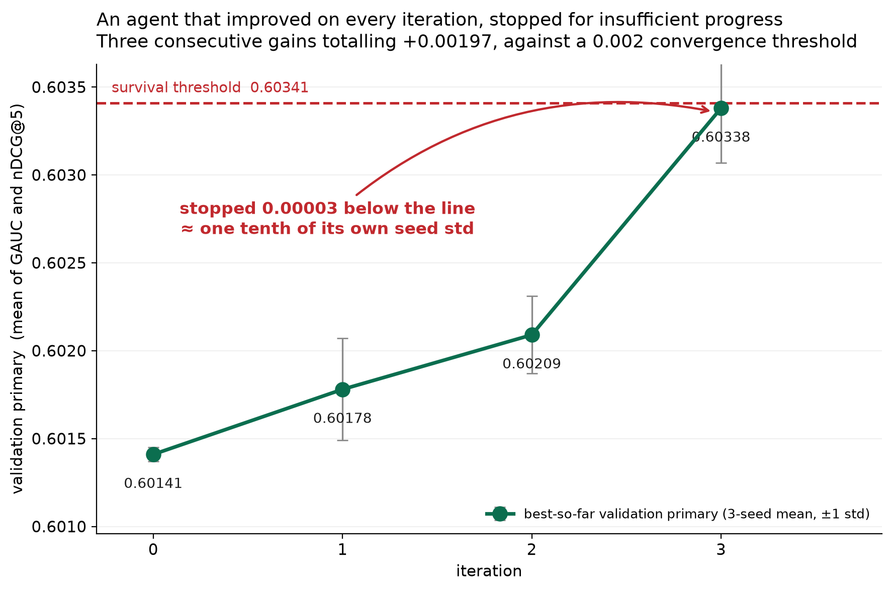
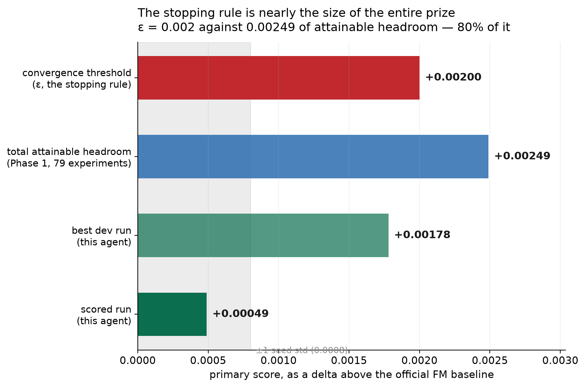
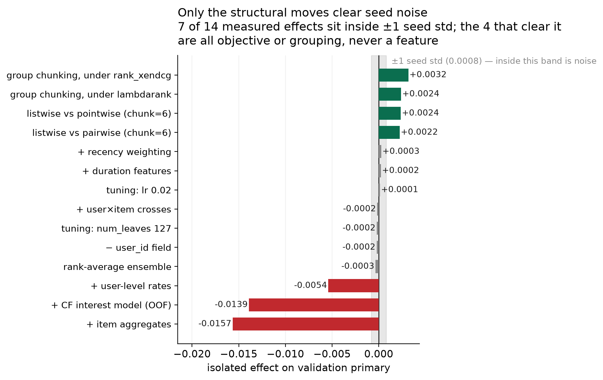

# An autonomous ML research agent for RecSys — KuaiRand-Pure

TikTok TechJam 2026, Track 2. An LLM-driven agent that runs the full MLE loop —
reproduce the baseline, form hypotheses, engineer features, train, evaluate,
reflect, repeat — on KuaiRand-Pure, with **zero human interventions** during the
scored run.

> **The headline result is a critique of the benchmark, not a score.**
> In one run the agent improved its validation score on **three consecutive
> iterations**, monotonically, with no wasted move — accumulating **+0.00197**
> against a convergence threshold of **0.002**. It was stopped for *insufficient
> progress*, **0.00003 short**, about a tenth of its own seed standard deviation.
> An agent that improved on every single iteration was terminated for not
> improving. See [F9](reports/REPORT_SCAFFOLD.md).



## Results

| | GAUC | nDCG@5 | primary | delta |
|---|---|---|---|---|
| Official FM — validation | 0.6674 | 0.5357 | 0.6016 | — |
| **Agent — validation** (3-seed mean) | 0.6704 | 0.5378 | **0.60209** | **+0.00049** |
| Official FM — test | 0.6610 | 0.5282 | 0.5946 | — |
| **Agent — test** (scored once) | 0.6610 | 0.5286 | **0.5948** | **+0.0002** |

Zero alignment mismatches on test. **The test delta is smaller than the
baseline's own 0.0008 seed std** — it clears the baseline but is not
distinguishable from a tie, and we report it that way. Full table:
[reports/RESULTS.md](reports/RESULTS.md).

**Resources:** 4 iterations of 50 · **0 manual interventions** · 50,946 tokens ·
7.4 min wall-clock · 0 GPU-hours · proposer `claude-opus-5`.

## Why the numbers are small

A manual probe of **79 controlled experiments** (Phase 1) measured the
practically attainable headroom above the FM baseline at roughly **+0.0025**.
Three independent lines of evidence agree the benchmark is saturated:

1. The organizers' own ablations — more features, more capacity, both flat.
2. Swapping the model family entirely moves nothing: a pointwise GBDT scores
   0.6017 against the FM's 0.6016.
3. A collaborative-filtering feature *hurts* validation while consistently
   *helping* on randomised-exposure traffic — because validation impressions
   were already preference-matched by a strong production recommender. We are
   re-ranking a candidate set someone better-informed already filtered.

Against ~0.0025 of headroom, the stopping rule uses eps = 0.002. **The threshold
is roughly 80% of the entire prize**, which permits about one meaningful
experiment per run. That is the central finding of this project.





## Setup

Requires Python 3.13 (LightGBM has no 3.14 wheels) and `libomp` on macOS.

```bash
brew install libomp
uv venv --python 3.13 .venv
uv pip install --python .venv/bin/python numpy pandas scikit-learn lightgbm anthropic
```

Download the dataset (~45MB compressed) into the starter kit:

```bash
curl -L -o KuaiRand-Pure.tar.gz https://zenodo.org/records/10439422/files/KuaiRand-Pure.tar.gz
tar xzf KuaiRand-Pure.tar.gz -C kuairand-starter-kit/
```

Set your API key **in the environment only** — never in a file in this repo:

```bash
export ANTHROPIC_API_KEY='sk-ant-...'
export ANTHROPIC_WORKSPACE_ID='wrkspc_...'   # only for identity-linked keys
```

## Reproduce

```bash
./.venv/bin/python -m pytest -h >/dev/null 2>&1  # tests are plain scripts, see below
for t in firewall guards grouping designation liveness seeding_boundary; do
  ./.venv/bin/python tests/test_$t.py
done
```

Run the agent (a dev run; the scored run used `--mode scored`):

```bash
./.venv/bin/python agent/run_agent.py --mode dev --backend anthropic --run-id repro
```

Reproduce Phase 1's manual probe:

```bash
./.venv/bin/python experiments/p1_step1.py      # isolated loss-function delta
./.venv/bin/python experiments/p1_interaction.py # the 2x2, 5 seeds per cell
```

Build and score a submission (human-only paths, deliberately separate):

```bash
./.venv/bin/python src/human_only_make_submission.py sub.csv \
    --spec reports/designated_spec.json --i-am-a-human-and-the-agent-has-converged
./.venv/bin/python src/human_only_test_scoring.py sub.csv \
    --i-am-a-human-and-the-submission-is-locked --lock
./.venv/bin/python src/human_only_test_scoring.py sub.csv \
    --i-am-a-human-and-the-submission-is-locked --score
```

## How it works

**Two-tier action space.** The LLM emits a structured experiment spec; a
deterministic harness executes it. The agent never rewrites the pipeline, which
is what keeps token cost at ~51k for a full run.

**The agent derives its own hypotheses.** It is given the *action space* — every
move, including the ones our manual probe found to be dead ends — and a *domain
briefing* of structural facts (train averages 43.5 rows per user against 5.6 in
evaluation; the baseline optimises a pointwise loss while the metrics are
ranking metrics). It is **not** given any measured delta, any verdict about what
works, or the final config. `tests/test_seeding_boundary.py` enforces that with
72 assertions. In every run the agent independently derived train-group chunking
from the stated group-shape mismatch, at iteration 1 or 2.

**Ordering is derived, not hardcoded.** Candidates execute in descending order of
the proposer's own predicted gain, and every prediction must cite a briefing fact
by key. The controller has no opinion about which move is structural.

### Guards, all enforced in code

| guard | mechanism |
|---|---|
| **Test-set firewall** | two independent locks; the loader cannot construct a test split, and the evaluate wrapper raises on test-window data |
| **Out-of-fold encoding only** | checked *inside* the encoder, so agent-written code cannot route around it |
| **Drift gate** | build → check → *only if passed* → train. No code path yields a metric for a failing block |
| **Liveness** | aborts after 3 consecutive iterations that ran no experiment |
| **Designation** | the pre-registered submission rule executes in code and records an intervention if it cannot resolve |
| **One-shot test scoring** | submission hashed before the score is known; second scoring refused |

**156 tests.** The policy ([reports/POLICY.md](reports/POLICY.md)) classifies
every clause as CODE or PROMISE, so nothing reads as a mechanism that isn't one.

## Limitations, and what we would improve

**The result is small and we do not dress it up.** +0.0002 on test is inside the
baseline's seed noise. The honest claim is that a fully autonomous run cleared
the baseline on a saturated benchmark with zero interventions — not that it won
by a meaningful margin.

**The agent's gain predictions are badly calibrated** — it predicts 0.045–0.062
and realises 0.0003–0.0014, optimistic by two orders of magnitude. Its *ordering*
is sound, which is what the controller consumes. We deliberately did not fix
this: calibrating it would mean telling the agent the realistic scale of
achievable gains, which is the answer, and the seeding boundary exists to keep
that out.

**Four bugs were found only by running the real system**, never by tests written
from the specification: a duplicated `group_sizes` that killed every chunked
spec; a designation rule that could designate a config worse than the baseline;
a guard that let a run spin through all 50 iterations proposing nothing; and a
model string that was logged correctly for three attempts and never read back.
That last one is the pattern in miniature — **a logged value nobody checks is not
a control.**

**What we would do next.** Longer training-window aggregates keyed on cold items,
where the ID categoricals cannot already fit a per-item effect. A real
session-boundary definition instead of chunking by row count. And an explicit
argument to the organizers about the eps-to-headroom ratio, since it currently
selects for agents that guess a whole configuration in one shot over agents that
isolate variables.

## Deliverables

- [reports/RESULTS.md](reports/RESULTS.md) — results and resource report
- [reports/POLICY.md](reports/POLICY.md) — pre-registered evaluation policy, all clauses classified
- [reports/PHASE1_FINDINGS.md](reports/PHASE1_FINDINGS.md) — the 79-experiment manual probe
- [reports/HARNESS_DESIGN.md](reports/HARNESS_DESIGN.md) — architecture and seeding boundary
- [reports/SCORED_RUN_DISCLOSURE.md](reports/SCORED_RUN_DISCLOSURE.md) — every scored attempt, including three discarded
- [reports/REPORT_SCAFFOLD.md](reports/REPORT_SCAFFOLD.md) — findings F1–F11
- `reports/runlog_scored_final.jsonl` — the scored run's per-iteration log

## Contributions

Sole contributor: **Lim Junsheng**. Registered as a team, executed solo.
Development assisted by Claude Code (Claude Opus 5); the agent's own proposer
also runs on `claude-opus-5`.

## Data and licence

KuaiRand-Pure, from [KuaiRand](https://kuairand.com) via Zenodo record 10439422,
under its own licence. No external training data and no pretrained weights were
used. The starter kit in `kuairand-starter-kit/` is the organizers' code,
vendored unmodified.
